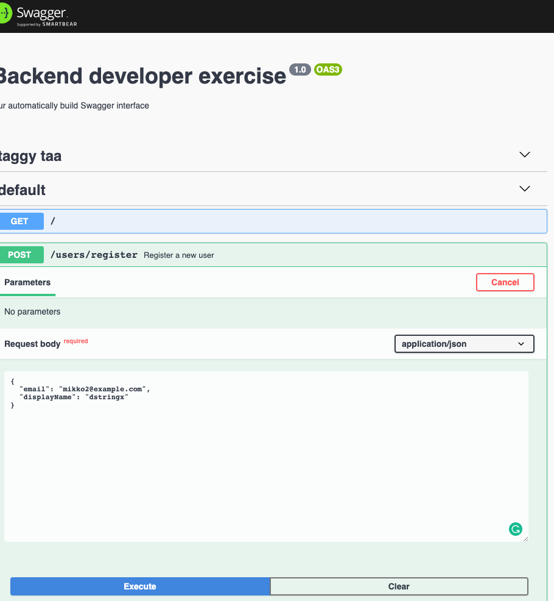

- [Introduction](#introduction)
- [Exercise](#exercise)
  * [Your task](#your-task)
  * [How to submit the exercise](#how-to-submit-the-exercise)
  * [How you will be ranked](#how-you-will-be-ranked)
- [Project description](#project-description)
- [Prerequisites](#prerequisites)
- [Installation](#installation)
  * [Setting up PostgreSQL database](#setting-up-postgresql-database)
  * [Setting up a local app](#setting-up-a-local-app)
  * [Running the app](#running-the-app)
  * [Manual usage using Swagger](#manual-usage-using-swagger)
- [Testing](#testing)
- [Database and migrations](#database-and-migrations)
  * [Automatically generating migrations](#automatically-generating-migrations)
  * [Run migrations against a local db](#run-migrations-against-a-local-db)
- [Troubleshooting](#troubleshooting)
  * [Restart database from the scratch](#restart-database-from-the-scratch)
  * [Display database content](#display-database-content)
  * [Debugging from Visual Studio Code](#debugging-from-visual-studio-code)
  * [Launching Jest from Visual Studio Code](#launching-jest-from-visual-studio-code)
- [Further reading](#further-reading)

# Introduction

This is a software development exercise for a TypeScript / Node.js backend developer position. 

- [See the open position description on StackOverflow](https://stackoverflow.com/jobs/361974/nodejs-and-typescript-backend-developer-firstblood)

- [Read more about our hiring process](https://github.com/miohtama/how-to-hire-developers)

# Exercise

## Your task

Your task is to 

- Add a new field `phoneNumber` for users

- This field is required during the registration process

- The field must save a normalised (i.e: no spaces or other separator characters) international phone number in the database.
  Technically, this is called MSISDN format. Please save the plus character prefix in the database.
  E.g. a valid column value would be `+358401231234` (Finland).

- You *do not* need to check if the phone number is legit - e.g. if the country code exists.
  This would be super difficult tasks as good heuristics do not exist.

- Update e2e tests to cover different phone number input cases - the API must gracefully handle different valid and invalid inputs

- Create necessary migrations to upgrade the production database

- In the pull request describe the changes and the actions that your colleagues need to understand: 
  API migration instructions for frontend developers, database migration instructions for a devop team

- For the extra impression, you can add other recommendations in the pull request commenting section. 
  However, any code and style changes, should go to its own separate pull request.
  The exercise pull request must consider only the task in the hand.

## How to submit the exercise

- [ ] Create a private copy of this Github repository
- [ ] Complete the task above
- [ ] Create a new pull request against your private repository
- [ ] In the PR, write down number of hours you spent on this exercise (we do not use this to rank you, we use it to adjust the laborisity of future exercises)
- [ ] Invite a Github user `miohtama` to your repository
- [ ] Send email to `dev-careers@fb.io` that you have completed the exercise

## How you will be ranked

We will look

- If the instructions were properly followed
- If the task was correctly completed
- Code quality
- Code comment quality
- Pull request commenting quality

# Project description

This exercise is based on [NestJS](https://github.com/nestjs/nest) framework TypeScript starter project.

The local development flow is

* PostgreSQL databases running in a docker image: local development and integration testing databases.
  PostgreSQL docker binds non-default port 54320.

* App and NestJS is installed locally, not inside Docker

* The project uses [NestJS OpenAPI (Swagger) plugin for automatic interface generation](https://docs.nestjs.com/recipes/swagger#plugin).

The development environment is tested on OSX, but should work on Linux systems unmodified. 
We do not recommend trying to undertake the exercise on native Windows.

# Prerequisites

* You need to understand UNIX shell, TypeScript, Node.js, Docker, PostgreSQL 

* This exercise was developed on Node v11.0.0

# Installation

## Setting up PostgreSQL database

This is will make a new PostgreSQL running in the standard port 5432. 
Please shutdown any previous conflicting PostgreSQL instances before starting this.

```bash
docker-compose up -d
```

Check it is up

```bash
docker logs -f local_db
```

Create an empty development database:

```
docker exec -it local_db psql -U local_dev -c "create database local_db" -d template1
```

Check that you can log into a database with `psql`

```bash
docker exec -it local_db psql -U local_dev local_db
```

## Setting up a local app

Then do the local app installation

```bash
npm install
```

Generata a `dist` folder (this will transpile .ts migrations to .js)

```bash
npm run build
```

Run initial migrations to set up initial database tables

```bash
npm run migration:run
```

## Running the app

Development
```bash 
npm run start
```

Then visit http://localhost:3000 to get the app landing page.
There is nothing to see there.

Visit http://localhost:3000/api/ to get the Swagger generated REST API tool.
which you can use against a hot reloading dev server.



To run the dev server in watch mode:

```bash
npm run start:dev
```

## Manual usage using Swagger

1. Post a registration request to `/register`

2. Confirm your email using `/users/confirm-email-admin`

# Testing

Please note that the server logger is not muted during these tests, so you get API errors logged in the console.

Create the testing database (needs to be done only once).
```bash
docker exec -it local_db psql -U local_dev -c "create database e2e_test" local_db  
```

Run jest:
```bash
npm run test:e2e
```

We have only integration tests. No unit tests are available, or asked, in this exercise.


# Database and migrations

## Automatically generating migrations

You can generate migration files 

1) After updating entity source code

2) You have an up-to-date local development database

```bash

# Rebuild transpilation
npm run build  

# You need to start the dev server to generate dist/migrations 
# NestJS bug https://github.com/nrwl/nx/issues/1393
npm run start

# Create a file under migration/
npm run migration:generate -- -n CreateUsers
```

## Run migrations against a local db

```bash
npm run migration:run
```

Check the result of migrations
```bash
docker exec -it local_db psql -U local_dev -c "\dt" local_db
```

# Troubleshooting

## Restart database from the scratch

Nuking the local development database:

```bash
docker-compose down -v
```

## Display database content

See what lurks in the user table:
```bash
docker exec -it local_db psql -U local_dev -c "select * from site_user" local_db
```

And for the e2e DB:
```bash
docker exec -it local_db psql -U local_dev -c "select * from site_user" e2e_test
```

## Debugging from Visual Studio Code

Visual Studio Code Auto [Attach feature] works.

You just need to run 

```bash
npm run start:debug
```

... and Visual Studio Code will notice this and the debugger bar appears. All breakpoints are honoured.

## Launching Jest from Visual Studio Code

Example launcher how to attach a debugger to Jest tests.

```json
{
    "version": "0.2.0",
    "configurations": [
        
        {
            "type": "node",
            "request": "launch",
            "name": "Jest All",
            "program": "${workspaceFolder}/node_modules/.bin/jest",
            "args": [
                "--runInBand",
                "--config",
                "./test/jest-e2e.json"
            ],
            "console": "integratedTerminal",
            "internalConsoleOptions": "neverOpen",
            "disableOptimisticBPs": true,
            "windows": {
                "program": "${workspaceFolder}/node_modules/jest/bin/jest",
            },
            "env": {
                "PATH": "/Users/moo/.nvm/versions/node/v11.0.0/bin:${env:PATH}"
            },
        },
    ]    
}    
```

# Further reading

[NestJS and TypeORM in 30 minutes](https://blog.theodo.com/2019/05/an-overview-of-nestjs-typeorm-release-your-first-application-in-less-than-30-minutes/)

[Another NestJS and TypeORM tutorial](https://blog.echobind.com/up-and-running-nextjs-and-typeorm-2c4dff5d7250)

[PostgreSQL on Dockerhub](https://hub.docker.com/_/postgres)

[class-validator](https://github.com/typestack/class-validator)

[Cats NestJS + Swagger sample full example code](https://github.com/nestjs/nest/tree/master/sample/11-swagger)

[Testing database interaction with TypeORM](https://medium.com/@salmon.3e/integration-testing-with-nestjs-and-typeorm-2ac3f77e7628) and [related source code](https://github.com/p-salmon/nestjs-typeorm-integration-tests)
